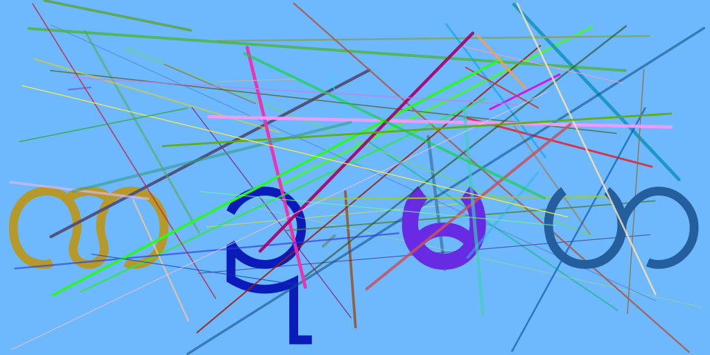

# Golang Myanmar Captcha

[](https://travis-ci.org/ezysign/myanmar-captcha)


**Captcha Image Generator using Myanmar Language**

## Installation

install using go get

`go get github.com/ezysign/myanmar-captcha/mmcaptcha`

## Documentation Here
https://godoc.org/github.com/ezysign/myanmar-captcha/mmcaptcha

## Result



## Usage


```go
package main

import (
	"fmt"

	"github.com/ezysign/myanmar-captcha/mmcaptcha"
)

func main() {
	captcha := mmcaptcha.NewMMCaptcha(1024, 512, 5, false, true, 15)
	cap := make(chan *mmcaptcha.CaptchaPayload)
	captcha.GenerateLargeCaptcha(cap)
	payload := <-cap
	fmt.Println(payload)
	close(cap)

}

```

## License

MIT